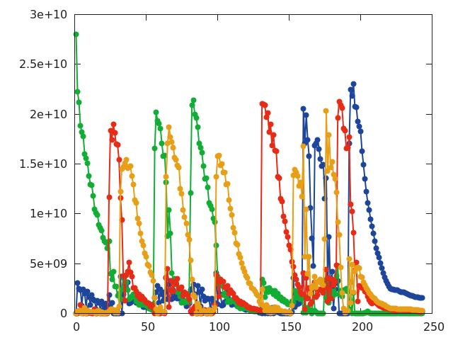
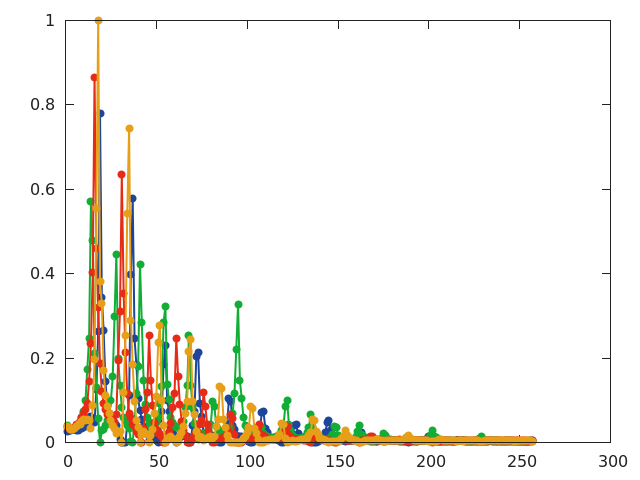

forked from [julia-nmf-ss-toy](https://github.com/r9y9/julia-nmf-ss-toy) into torch






---

julia-nmf-ss-toy
================

二乗誤差基準のNMFをシングルトラックの音源分離に適応する例です。昔の自分が [実装してみると書いていた](http://r9y9.github.io/blog/2013/07/27/nmf-euclid/) ので、気分転換に書いてみました。

大したもんではないですが、必要なコード（NMF、短時間フーリエ変換/逆短時間フーリエ変換）と、IJuliaのノートブックを置いておきます。

## ノート

[NMF-based Music Source Separation Demo.ipynb | nbviewer](http://nbviewer.ipython.org/github/r9y9/julia-nmf-ss-toy/blob/master/NMF-based%20Music%20Source%20Separation%20Demo.ipynb)

## サンプル

ノートに書いたコードから可視化部分を抜くと、こうなります

```julia
include("stft.jl")
include("nmf.jl")

using WAV

x, fs = wavread("test10k.wav")
@assert fs == 10000

x = vec(x)

framelen = 512
hopsize = div(framelen, 2)
X = stft(x, framelen, hopsize)

Y, phase = abs(X), angle(X)

# perform NMF on spectrogram
K = 4
srand(98765)
@time H, U = nmf_euc(Y, K)

for k=1:K
    y = istft(H[:,k]*U[k,:] .* exp(im * phase), framelen, hopsize)
    wavwrite(float16(y), string(k, ".wav"), Fs=fs)
end
```

`example.jl` として置いてあります。

```sh
julia example.jl
```

として実行してみてください。音源分離の結果がwavファイルとして書きだされます。

## ライセンス

MIT
